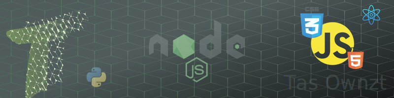

	

Hey, there

I'm Tiago and you can call me by nickname Tas Ownzt. Yeah! It's little weird, I know!
I like so much to study new things about technologies and because of that I'm graduating to Analysis and systems development.
Since 2011 I start to study programming languages more like a hobbie beggining with the  passed away Flash using the language ActionScript 3.0 when I was making a Digital Game course at Inove Plugminas. Since then passing by others
languages until the one I chose to my professional life and I decided to follow in 2019 to focus on web development.

### Web Development

- HTML5
- CSS3 and Sass
- JavaScript

### Favorite Language

- Python

### Others Languages that I know a little bit

- C/C++
- C#
- Java

### Frameworks

- ReactJs
- NextJs

### Contacts:

##

	
	

